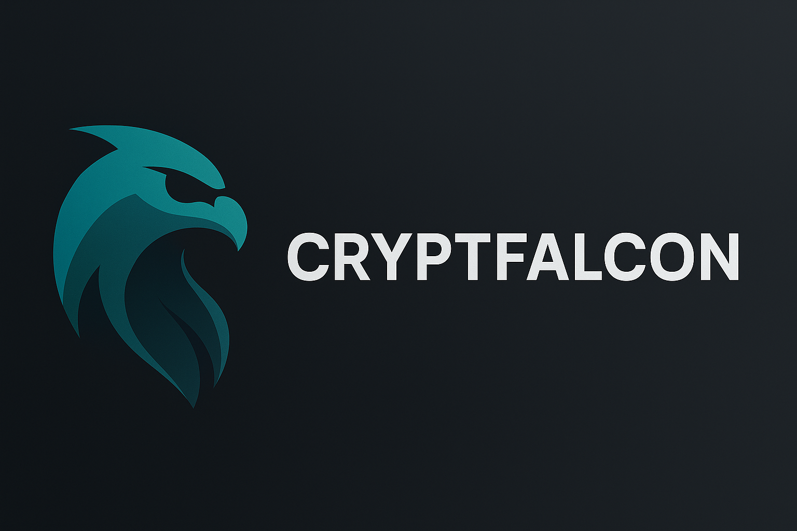

# 🦅 Cryptfalcon

> A professional-grade standalone crypto trading bot built with Electron, featuring multi-coin support, customizable strategies, real-time monitoring, and a sleek dark-mode UI.



## ✨ Features

- ✅ **Multi-coin support** – Trade BTC, ETH, SOL, BNB, and more
- ✅ **Custom strategy builder** – Define long/short entry logic with multiple conditions
- ✅ **API Key management** – Securely manage multiple exchange accounts (Binance)
- ✅ **Real-time price feed** – WebSocket-based price tracking
- ✅ **Local database (SQLite)** – Store trades, PnL history, bot configurations
- ✅ **Standalone Electron App** – No external server or browser required
- ✅ **System tray support** – Run bots in the background
- ✅ **Dark-themed, modern UI** – Built for clarity and speed

## 📦 Tech Stack

- `Electron` – Desktop app framework
- `Node.js` – Core trading logic
- `SQLite` – Lightweight embedded database
- `TailwindCSS + React` – (Optional) UI frontend
- `Binance API` – Price feed & trading execution

## 🚀 Getting Started

> Coming soon...

```bash
npm install
npm run build
npm start
